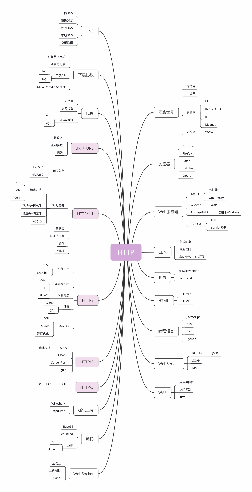

## HTTP是什么

HTTP - 超文本 传输 协议

## 协议

协 -- 多个参与者

议 -- 约定/规范(什么能做不能做，什么先做后做，做错了怎么处理)

## 传输

1. 双向

2. 允许中转，接力

## 超文本

1. 文本 -- 不是TCP/UDP 里被切分的杂乱无章的二进制包(datagram), 而是完整有意义的数据

2. 超文本 -- 文字，图片，视频，**超链接**

## HTTP不是什么  -- HTTP不能干什么

HTTP不能用于广播，寻址和路由

## HTTP 架构图

