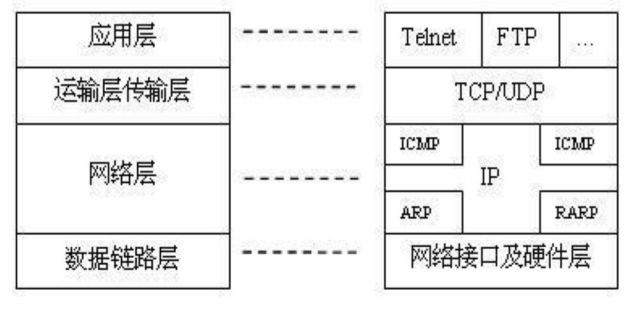

## http相关协议

## TCP/IP 协议

一系列网络通信协议统称，核心TCP, IP。还有UDP,ICMP,ARP

复杂但有层次

## IP协议

寻址，路由，如何在两点间发数据包

## TCP 

可靠 : 保证数据不丢失

字节流 : 保证数据完整

## DNS (Domain Name System)

域名解析

## URI / URL

URI (Uniform Resource Identifier) -- 唯一标记互联网上资源

URL (Uniform Resource Locator)  -- URI子集

使用两种方法定位：1，URL，用地址定位；2，URN 用名称定位。

URL都是URI，但是URI不一定是URL

## https

HTTP over SSL/TLS

SSL (Secure Socket Layer)  -- 后改名 TLS (Transport Layer Security)

## 代理(Proxy)

请求方和应答方的中转站，既可以转发客户端的请求，也可以转发服务器的应答

1. 匿名应答

2. 透明应答

3. 正向代理

4. 反向代理

notes : CDN就是一种代理,透明/反向

在代理中可以:

1. 负载均衡

2. 内容缓存

3. 安全防护

4. 数据处理

