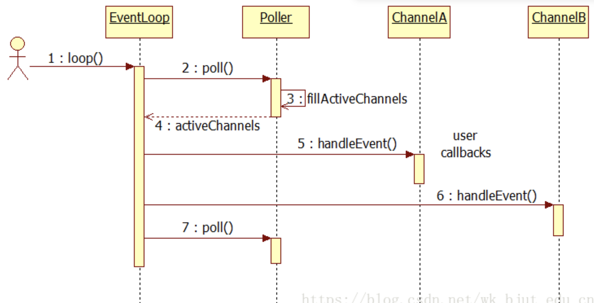
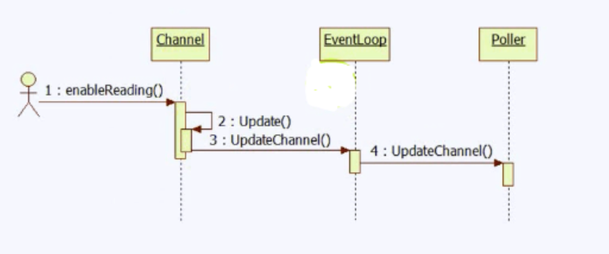

## reactor 架构

[reactor深度参考muduo]

Reactor： 即非阻塞同步网络模型，向内核去注册一个感兴趣的事件，事件来了去通知你去处理

## eventloop, epoll, channel

这是第一个最为核心的三角关系

Epoll负责多路复用

EventLoop 事件循环

Channel 负责事件分发，将拿到的IO事件分发给各个文件描述符fd的事件处理函数



程序最为重要的就是loop循环

```cpp
void EventLoop::loop() {
    assert(!looping_);
    assertInLoopThread();
    looping_ = true;
    quit_ = false;  
    TRACE("EventLoop {} start looping", fmt::ptr(this));
    
    while(!quit_) {
        activeChannels_.clear();
        epollWaitReturnTime_ = epoll_->wait(kEpollTimesMs, activeChannels_);
        ++iteration_;
        printActiveChannels();
        eventHandling_ = true;
        for(auto channel: activeChannels_) {
            currentActiveChannel_ = channel;
            currentActiveChannel_->handleEvent(epollWaitReturnTime_);
        }
        currentActiveChannel_ = nullptr;
        eventHandling_ = false;
        doQueueInLoopFuncs();
    }
    TRACE("EventLoop {} stop looping", fmt::ptr(this));
    looping_ = false;
}
```

loop循环中不断的通过epoll_wait获取来临的关注事件，然后执行这些事件所对应的callback

这里就有两个问题

1. 如何关注事件

2. 如何执行对应callback

## 如何关注事件

比如为了唤醒epoll, 我们关注wakeupChannel 

```cpp
// 1. 我们在EventLoop成员变量中定义
std::unique_ptr<Channel> wakeupChannel_;

// 2. EventLoop 构造函数去构造出对象
wakeupFd_(sockets::createEventfd()),
wakeupChannel_(util::make_unique<Channel>(this, wakeupFd_)),

// 3. EventLoop 构造函数中设置channel对应执行的函数
wakeupChannel_->setReadCallback(std::bind(&EventLoop::handleWakeupFd, this));
// 这里将channel关注read事件(上epoll的关注二叉树)
wakeupChannel_->enableReading();  
```

这里上树的流程分析 ：

EventLoop在做channel和epoll的桥梁

```cpp
// channel enableReading()通过update通知EventLoop
void enableReading() { events_ |= kReadEvent; update(); }

void Channel::update() {
    addedToEpoll_ = true;
    loop_->updateChannel(this);
}

// 然后在EventLoop中调用Epoll上树
void EventLoop::updateChannel(Channel* channel) {
    assert(channel->ownerLoop() == this);
    assertInLoopThread();
    epoll_->updateChannel(channel);
}
```

然后之后关注的事件来临时，通过epoll_wait内核通知



## 如何执行对应callback

我们在loop中拿到了activeChannels_, 是通过epoll.wait()中fillActiveChannels获取

```cpp
void Epoll::fillActiveChannels(int numEvents, 
            std::vector<Channel *>& activeChannels) const {
    for(int i = 0; i < numEvents; i++) {
        Channel* channel = static_cast<Channel*>(eventList_[i].data.ptr);

        channel->setRevents(eventList_[i].events);
        activeChannels.push_back(channel);
    }
}

```

取出后依次执行handleEvent()

```cpp
void Channel::handleEvent(Timestamp receiveTime) {
    std::shared_ptr<void> guard;
    // todo 分析下主动关闭时候TcpConnectionPtr的生命周期
    if(tied_) {
        guard = tie_.lock();  // 提升 + 1
        if(guard) {
            // TRACE("[6] usecount = {}", guard.use_count());  // 2
            handleEventWithGuard(receiveTime);
            // TRACE("[12] usecount = {}", guard.use_count());  // 2 出了这个函数引用计数则为 1, 在connectDestoyed里保留一个，执行完后销毁
        }
    } else {
        handleEventWithGuard(receiveTime);
    }
}

void Channel::handleEventWithGuard(Timestamp receiveTime) {
    eventHandling_ = true;
    if ((revents_ & EPOLLHUP) && !(revents_ & EPOLLIN)) {
        if (logHup_) {
            WARN("fd = {}  Channel::handle_event EPOLLHUP", fd_);
        }
        if (closeCallback_) closeCallback_();
    }

    if (revents_ & EPOLLERR) {
        if (errorCallback_) errorCallback_();
    }
    if (revents_ & (EPOLLIN | EPOLLPRI | EPOLLRDHUP)) {
        if (readCallback_) readCallback_(receiveTime);
    }
    if (revents_ & EPOLLOUT) {
        if (writeCallback_) writeCallback_();
    }
    eventHandling_ = false;
}

```

